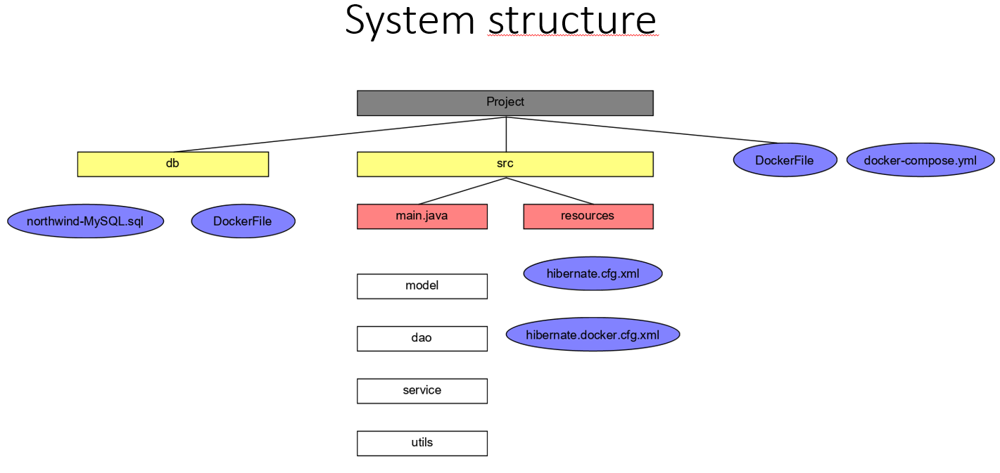
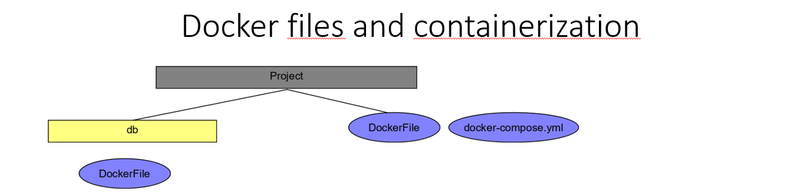
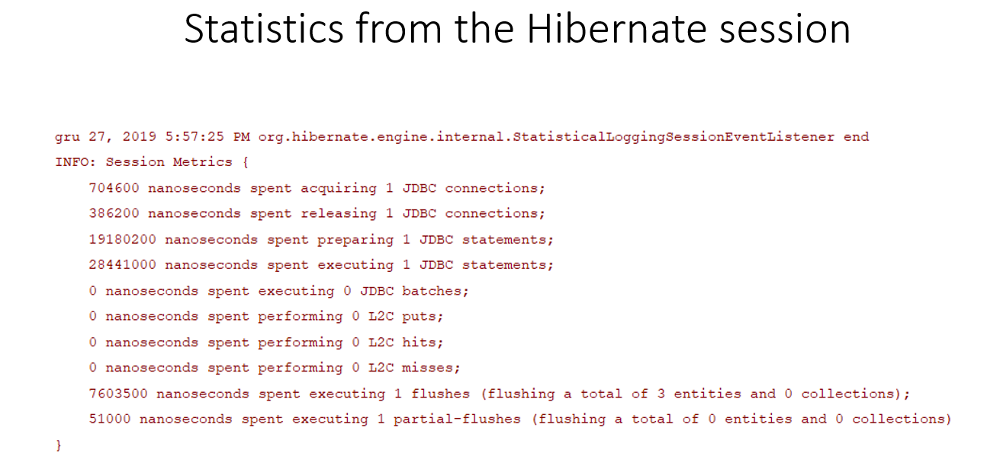
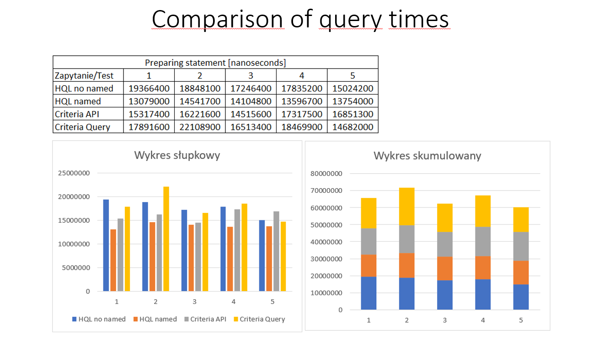
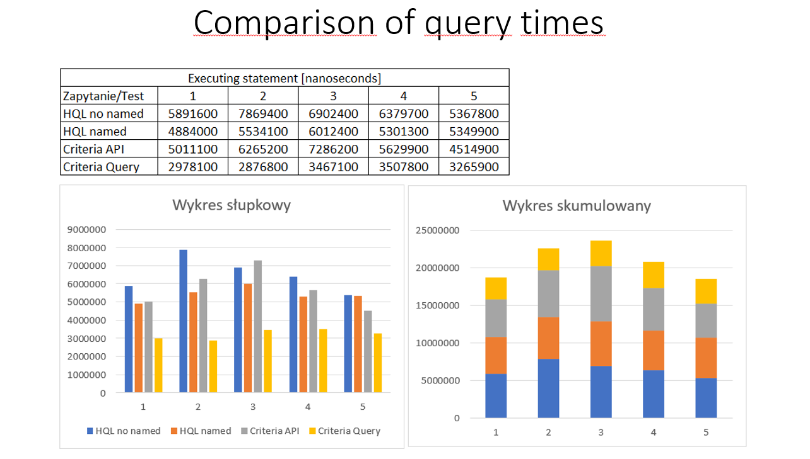
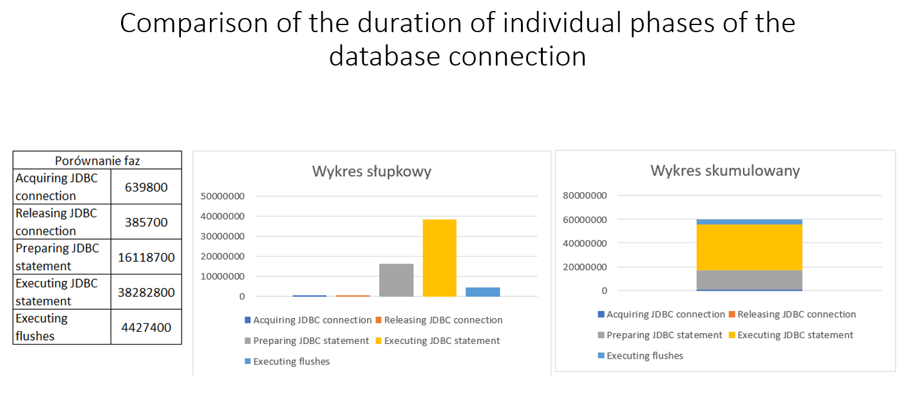

# Northwind-database
The system that implements selected basic operations in Northwind sample database

## Selected technologies
*	MySql
*	Hibernate
*	Java
*	Docker
* Maven

## Presentation of the project
 

  

  

  

  

  

  

  

  

  

  

  

  

  

## How to run a project?
1.	Clone or download a project from github 
2.	Make sure you have the above tools installed (the correct versions can be found in the pom/gradle file)
3.	Open project in IntelliJ IDEA (an Ultimate version may be required)
4.	Run the project and have fun
